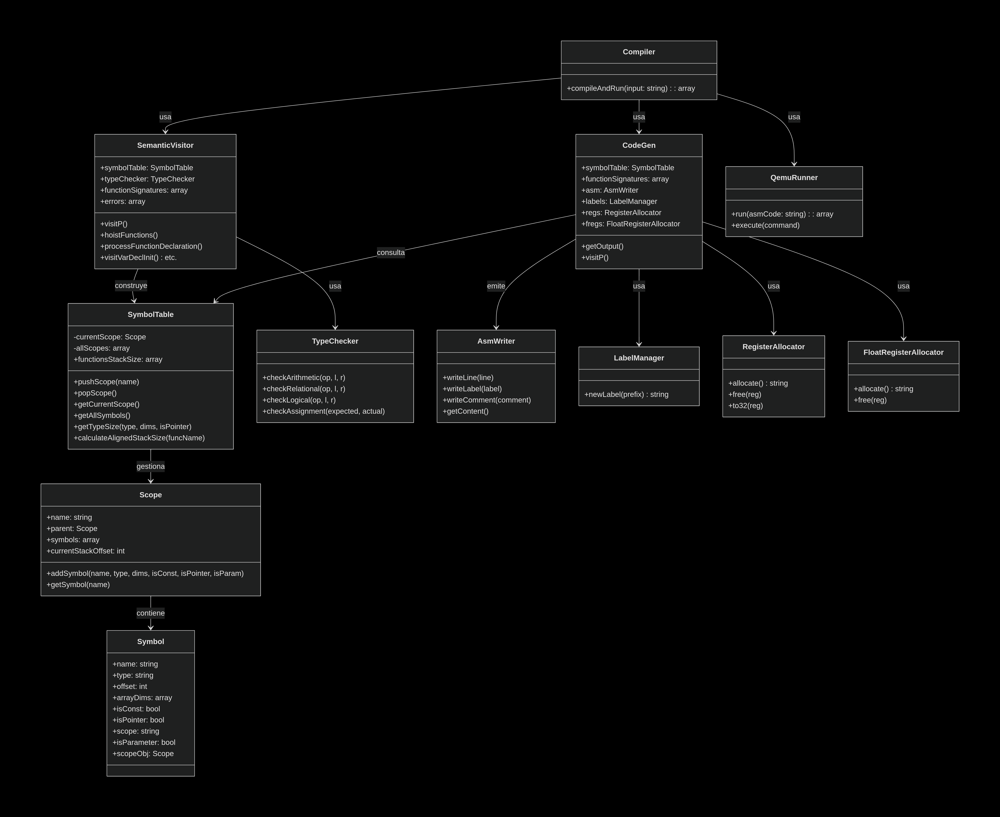
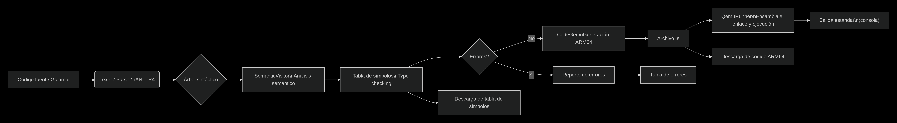
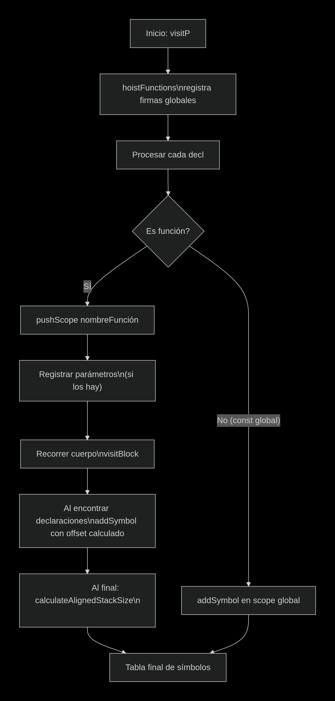

# Documentación Técnica — Compilador Golampi

**Universidad San Carlos de Guatemala**
Organización de Lenguajes y Compiladores 2

| Campo      | Detalle                                 |
| ---------- | --------------------------------------- |
| Estudiante | René Gutiérrez                          |
| Carné      | 202300540                               |
| Proyecto   | Proyecto 2 — Compilador Golampi a ARM64 |

---

## Tabla de Contenidos

1. [Gramática Formal de Golampi](#1-gramática-formal-de-golampi)
2. [Arquitectura del Compilador](#2-arquitectura-del-compilador)
3. [Fases del Compilador](#3-fases-del-compilador)
4. [Modelo de Memoria y Offsets](#4-modelo-de-memoria-y-offsets)
5. [Reportes](#5-reportes)
6. [Manejo de Errores](#6-manejo-de-errores)

---

## 1. Gramática Formal de Golampi

La gramática de Golampi está definida en ANTLR4 con target PHP. Describe todas las construcciones válidas del lenguaje fuente que el compilador reconoce, analiza y traduce a ensamblador ARM64.

---

### 1.1 Programa

Un programa Golampi es una secuencia de declaraciones (`decl`) seguida del fin de archivo. Las declaraciones pueden ser funciones o constantes globales.

```ebnf
programa    ::= decl* EOF
decl        ::= funcDecl
              | 'const' ID type_ '=' e ';'?
```

---

### 1.2 Declaración de Funciones

Una función se define con `func`, un nombre, parámetros opcionales y un tipo de retorno (simple o múltiple). Golampi admite las siguientes variantes:

| Variante              | Descripción                              |
| --------------------- | ---------------------------------------- |
| `FuncDeclVoid`        | Procedimiento sin retorno                |
| `FuncDeclReturn`      | Función con retorno de un único valor    |
| `FuncDeclMultiReturn` | Función con retorno de dos o más valores |

Los parámetros pueden ser de tipo escalar, arreglo N-D o puntero.

```ebnf
funcDecl    ::= 'func' ID '(' params? ')' bloque
              | 'func' ID '(' params? ')' returnType bloque
              | 'func' ID '(' params? ')' '(' returnType (',' returnType)* ')' bloque

params      ::= param (',' param)*

param       ::= ID type_               -- escalar
              | ID arrayType type_     -- arreglo N-D
              | ID '*' type_           -- puntero a escalar
              | ID '*' arrayType type_ -- puntero a arreglo N-D

returnType  ::= type_
              | arrayType type_
```

---

### 1.3 Bloque

Un bloque delimita un ámbito léxico.

```ebnf
bloque      ::= '{' stmt* '}'
```

---

### 1.4 Sentencias

Las sentencias cubren declaración de variables, constantes, asignaciones simples y compuestas, punteros, arreglos, impresión, control de flujo, ciclos, llamadas a función, retorno, `break` y `continue`.

```ebnf
stmt        ::= 'var' ID arrayType type_ ';'?
              | 'var' ID arrayType type_ '=' arrayLit ';'?
              | 'var' ID type_ '=' e ';'?
              | 'var' ID type_ ';'?
              | 'var' ID (',' ID)+ type_ '=' e (',' e)* ';'?
              | 'var' ID (',' ID)+ '=' e ';'?
              | 'const' ID type_ '=' e ';'?
              | ID ':=' e ';'?
              | ID ':=' arrayLit ';'?
              | ID (',' ID)+ ':=' e (',' e)* ';'?
              | ID '=' e ';'?
              | ID '+=' e ';'?
              | ID '-=' e ';'?
              | ID '*=' e ';'?
              | ID '/=' e ';'?
              | ID '++' ';'?
              | ID '--' ';'?
              | '*' ID '=' e ';'?
              | ID ('[' e ']')+ '=' e ';'?
              | 'fmt.Println' '(' (e (',' e)*)? ')' ';'?
              | ID '(' (e (',' e)*)? ')' ';'?
              | 'if' e bloque ('else' bloque)? ';'?
              | 'if' e bloque 'else' stmt
              | 'for' e bloque ';'?
              | 'for' bloque ';'?
              | 'for' varForInit ';' e ';' forPost bloque ';'?
              | 'switch' e? '{' switchCase* '}' ';'?
              | 'return' (e (',' e)*)? ';'?
              | 'break' ';'?
              | 'continue' ';'?
```

---

### 1.5 Expresiones

Las expresiones incluyen literales, variables, acceso a arreglos, llamadas a función, operadores aritméticos, relacionales, lógicos, unarios y punteros. La precedencia se lista de menor a mayor:

| Nivel | Operadores                  |
| ----- | --------------------------- |
| 1     | `\|\|`                      |
| 2     | `&&`                        |
| 3     | `==`, `!=`                  |
| 4     | `<`, `>`, `<=`, `>=`        |
| 5     | `+`, `-`                    |
| 6     | `*`, `/`, `%`               |
| 7     | Unarios: `-`, `!`, `&`, `*` |
| 8     | Agrupación `(` `)`          |

```ebnf
e           ::= BOOL_LIT | INT_LIT | FLOAT_LIT | STRING_LIT | RUNE_LIT | 'nil'
              | ID
              | ID ('[' e ']')+                      -- acceso arreglo N-D
              | ID '(' (e (',' e)*)? ')'             -- llamada a función
              | 'fmt.Println' '(' (e (',' e)*)? ')'
              | 'len' '(' e ')'
              | 'now' '(' ')'
              | 'substr' '(' e ',' e ',' e ')'
              | 'typeOf' '(' e ')'
              | '(' e ')'
              | '-' e
              | '!' e
              | '&' ID
              | '*' ID
              | e ('*'|'/'|'%') e
              | e ('+'|'-') e
              | e ('<'|'>'|'<='|'>=') e
              | e ('=='|'!=') e
              | e '&&' e
              | e '||' e
```

---

### 1.6 Tipos

```ebnf
type_       ::= 'int32' | 'int' | 'float32' | 'bool' | 'rune' | 'string'
              | '*' type_
```

---

### 1.7 Arreglos N-D

La gramática soporta arreglos multidimensionales de cualquier profundidad mediante `arrayType` (una o más dimensiones) y literales anidados `arrayContent`.

```ebnf
arrayType    ::= ('[' INT_LIT ']')+

arrayLit     ::= arrayType type_ '{' arrayContent '}'

arrayContent ::= arrayRow (',' arrayRow)* ','?
               | (e (',' e)* ','?)?

arrayRow     ::= '{' arrayContent '}'
```

---

### 1.8 Tokens

```ebnf
BOOL_LIT      : 'true' | 'false'
INT_LIT       : [0-9]+
FLOAT_LIT     : [0-9]+ '.' [0-9]+
RUNE_LIT      : '\'' ( ~['\\\r\n] | '\\' . ) '\''
STRING_LIT    : '"'  ( ~["\\\r\n] | '\\' . )* '"'
ID            : [a-zA-Z_][a-zA-Z0-9_]*
LINE_COMMENT  : '//' ~[\r\n]* -> skip
BLOCK_COMMENT : '/*' .*? '*/' -> skip
WS            : [ \t\r\n]+ -> skip
```

---

## 2. Arquitectura del Compilador

El compilador sigue una arquitectura monolítica cliente-servidor con fases bien separadas. Se ejecuta completamente en el backend PHP, generando código ARM64 que luego se ensambla, enlaza y ejecuta mediante QEMU.

---

### 2.1 Diagrama de Clases



---

### 2.2 Diagrama de Flujo del Procesamiento



---

### 2.3 Flujo de la Tabla de Símbolos



---

## 3. Fases del Compilador

---

### 3.1 Análisis Léxico y Sintáctico

Se utiliza ANTLR4 para generar el lexer (`GolambiLexer`) y el parser (`GolambiParser`) a partir de la gramática `Golampi.g4`. El parser construye un árbol sintáctico concreto que es recorrido posteriormente por el `Visitor`.

---

### 3.2 Análisis Semántico — `SemanticVisitor`

El `SemanticVisitor` realiza las siguientes tareas:

**Hoisting y tabla de símbolos**

Recoge todas las firmas de funciones antes de analizar los cuerpos, y construye la tabla de símbolos con ámbito, tipo, offset y atributos.

**Verificaciones realizadas**

- Declaración previa de identificadores.
- Compatibilidad de tipos en asignaciones, operaciones, llamadas a función y retornos.
- No modificación de constantes.
- Existencia de la función `main`.

**Cálculo de offsets**

Calcula offsets de stack para variables locales y arreglos, respetando el crecimiento hacia abajo del stack ARM64. Los offsets son negativos y se almacenan en cada `Symbol`.

**Ámbitos anidados**

Maneja ámbitos mediante una pila de `Scope`. Cada nuevo bloque (`if`, `for`, `switch`) crea un ámbito hijo que hereda el offset del padre, evitando colisiones.

---

### 3.3 Generación de Código ARM64 — `CodeGen`

El `CodeGen` recorre el árbol y traduce cada construcción a instrucciones AArch64. Sus componentes principales son:

| Componente               | Responsabilidad                                                      |
| ------------------------ | -------------------------------------------------------------------- |
| `AsmWriter`              | Acumula el código ensamblador con indentación y etiquetas            |
| `LabelManager`           | Genera etiquetas únicas para saltos y datos                          |
| `RegisterAllocator`      | Gestiona registros enteros `x0`–`x15` y su versión 32-bit `w0`–`w15` |
| `FloatRegisterAllocator` | Gestiona registros de punto flotante `s0`–`s15`                      |
| Módulos por sentencia    | Asignaciones, expresiones, control de flujo, impresión, funciones    |

**Generación del programa completo**

En `visitP()` se emiten:

- Sección `.data` con literales de cadena, flotantes y cadenas auxiliares (`"true"`, `"false"`, `"\n"`).
- Sección `.text` con las rutinas `print_int` (imprime entero) y `print_cstr` (imprime cadena terminada en nulo).
- Las funciones declaradas se recorren a continuación.

**Manejo del stack frame**

Cada función genera el siguiente prólogo y epílogo:

```asm
func:
    stp x29, x30, [sp, #-16]!
    mov x29, sp
    sub sp, sp, #<tamaño_aligned>
    ...
    add sp, sp, #<tamaño_aligned>
    ldp x29, x30, [sp], #16
    ret
```

Los parámetros recibidos en `x0`–`x7` / `s0`–`s7` se guardan en los offsets calculados por el análisis semántico.

**Arreglos y punteros**

- Los arreglos locales se alojan en el stack; el acceso usa `[x29, offset]` y aritmética de índices.
- Los arreglos pasados por puntero siguen la dirección almacenada en el stack.
- Se utiliza `memcpy` para inicialización profunda.

**Punto flotante**

Los literales `float32` se almacenan en `.data` como `.word` y se cargan con `fmov`. Las operaciones flotantes utilizan `fadd`, `fsub`, `fmul`, `fdiv`, `fneg`, y las instrucciones de conversión `scvtf` / `fcvtzs`.

**Built-ins**

| Función  | Comportamiento                                                            |
| -------- | ------------------------------------------------------------------------- |
| `len`    | Sobre arreglos devuelve tamaño estático; sobre strings recorre hasta `\0` |
| `typeof` | Retorna una cadena con el tipo inferido                                   |
| `now`    | Usa syscall `gettimeofday` o `time` + `ctime` enlazado a librería C       |
| `substr` | Devuelve la dirección desplazada dentro del string                        |

**Cortocircuito lógico**

Los operadores `&&` y `||` generan saltos condicionales que evitan evaluar el segundo operando cuando el primero determina el resultado.

---

### 3.4 Ensamblaje, Enlace y Ejecución — `QemuRunner`

El código generado se guarda en un archivo `.s` temporal. El proceso completo es el siguiente:

1. Se ensambla con `aarch64-linux-gnu-as` produciendo un objeto `.o`.
2. Se enlaza con `aarch64-linux-gnu-ld` produciendo el ejecutable.
3. Se ejecuta con `qemu-aarch64` capturando la salida estándar.

Todo ocurre en directorios temporales que se limpian al finalizar.

---

## 4. Modelo de Memoria y Offsets

El compilador implementa un modelo de stack acorde a la convención de llamadas AArch64:

| Registro | Rol                                  |
| -------- | ------------------------------------ |
| `x29`    | Frame pointer                        |
| `x30`    | Link register (dirección de retorno) |
| `sp`     | Stack pointer                        |

Las variables locales se ubican debajo de `x29` con offsets negativos. Los parámetros, al ser recibidos en registros, se copian al stack para unificar el acceso.

**Ejemplo de cálculo de offsets:**

```
int32   x         →  4 bytes  →  offset = -4
float32 y         →  4 bytes  →  offset = -8
bool    flag      →  4 bytes  →  offset = -12
char    name[32]  → 32 bytes  →  offset = -44

Espacio total alineado a 16 bytes: 48 bytes.
```

El offset se almacena en el símbolo y se usa directamente en instrucciones como:

```asm
ldr w0, [x29, #-8]
```

---

## 5. Reportes

El compilador genera tres tipos de reportes:

| Reporte                                   | Contenido                                                                            |
| ----------------------------------------- | ------------------------------------------------------------------------------------ |
| Errores léxicos, sintácticos y semánticos | Tabla con tipo, descripción, línea y columna                                         |
| Tabla de símbolos                         | Identificadores con tipo, ámbito, offset, dimensiones, y si es constante o parámetro |
| Código ARM64                              | Archivo `.s` completo descargable                                                    |

Estos reportes se muestran en la interfaz web y pueden descargarse individualmente.

---

## 6. Manejo de Errores

El `SemanticVisitor` acumula errores sin detener el análisis, permitiendo reportar múltiples problemas en una sola pasada.

**Errores semánticos detectados:**

- Variable no declarada.
- Constante modificada.
- Función no declarada.
- Llamada explícita a `main` (detectada durante el análisis semántico).
- Incompatibilidad de tipos en asignaciones o expresiones.
- Número incorrecto de argumentos o valores de retorno.
- Operaciones sobre `nil`.

Los errores léxicos y sintácticos son capturados por el parser de ANTLR y se integran en el mismo flujo de reporte.

---

_Universidad San Carlos de Guatemala — Organización de Lenguajes y Compiladores 2_
