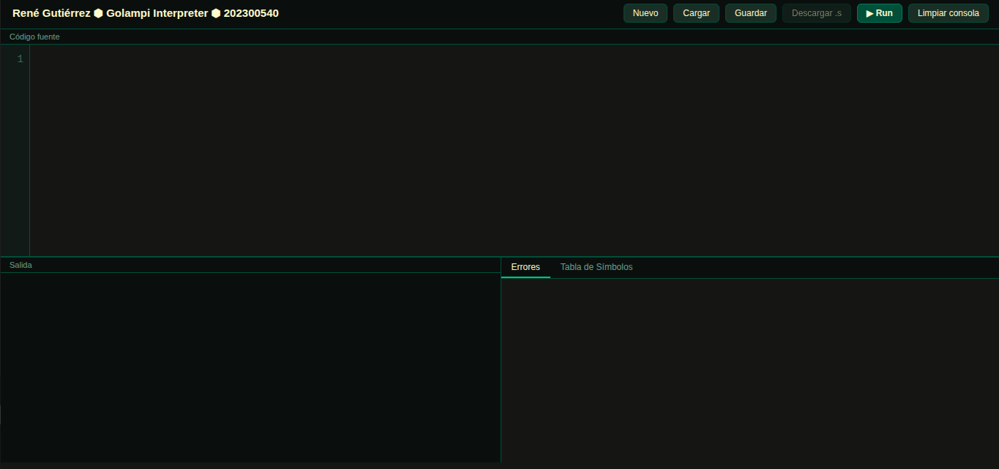
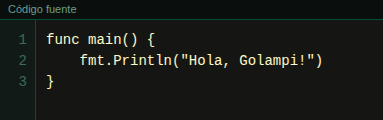
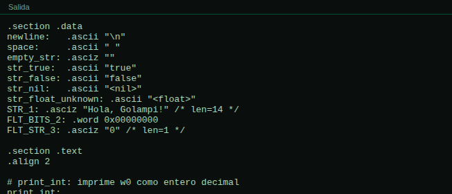

# Manual de Usuario — Compilador Golampi

**Universidad San Carlos de Guatemala**
Organización de Lenguajes y Compiladores 2

| Campo      | Detalle                                 |
| ---------- | --------------------------------------- |
| Estudiante | René Gutiérrez                          |
| Carné      | 202300540                               |
| Proyecto   | Proyecto 2 — Compilador Golampi a ARM64 |
| Ciclo      | 1 — 2026                                |

---

## Tabla de Contenidos

1. [Requisitos del Sistema](#1-requisitos-del-sistema)
2. [Instalación](#2-instalación)
3. [Interfaz de Usuario](#3-interfaz-de-usuario)
4. [Crear, Editar y Ejecutar Código](#4-crear-editar-y-ejecutar-código)
5. [Interpretación de los Reportes](#5-interpretación-de-los-reportes)
6. [Ejemplos de Sesión de Uso](#6-ejemplos-de-sesión-de-uso)
7. [Solución de Problemas Comunes](#7-solución-de-problemas-comunes)

---

## 1. Requisitos del Sistema

Antes de instalar el compilador, asegúrese de contar con las siguientes herramientas en el entorno de ejecución:

| Requisito           | Versión / Descripción                          |
| ------------------- | ---------------------------------------------- |
| PHP                 | 8.1 o superior                                 |
| Java                | 11 o superior (requerido por ANTLR4)           |
| ANTLR4              | 4.13 o superior                                |
| Composer            | 2.x                                            |
| Herramientas ARM64  | `aarch64-linux-gnu-as`, `aarch64-linux-gnu-ld` |
| QEMU (modo usuario) | `qemu-aarch64`                                 |
| Navegador web       | Chrome, Firefox o Edge en versión reciente     |

> Las herramientas ARM64 y QEMU son indispensables: el compilador produce ensamblador AArch64 que se ensambla, enlaza y ejecuta mediante QEMU en modo usuario. Sin ellas, la fase de ejecución no podrá completarse.

---

## 2. Instalación

### 2.1 Clonar el repositorio

```bash
git clone https://github.com/usuario/OLC2_PROYECTO2_202300540.git
cd OLC2_PROYECTO2_202300540
```

### 2.2 Instalar dependencias PHP

```bash
composer install
```

Este comando descarga la librería `antlr/antlr4-php-runtime` en el directorio `vendor/`.

### 2.3 Regenerar el parser (opcional)

Solo es necesario si se modifica la gramática `Golampi.g4`:

```bash
antlr4 -Dlanguage=PHP Golampi.g4 -visitor -o src/
```

### 2.4 Verificar herramientas ARM64 y QEMU

Confirme que los comandos `aarch64-linux-gnu-as`, `aarch64-linux-gnu-ld` y `qemu-aarch64` estén disponibles en el `PATH`. En distribuciones Ubuntu o Debian se instalan con:

```bash
sudo apt install binutils-aarch64-linux-gnu qemu-user
```

### 2.5 Iniciar el servidor web

```bash
php -S localhost:8000
```

Abra el navegador y acceda a `http://localhost:8000`.

---

## 3. Interfaz de Usuario



---



---



La interfaz consta de cuatro áreas principales:

| Área                  | Descripción                                                            |
| --------------------- | ---------------------------------------------------------------------- |
| Barra de herramientas | Botones para crear, cargar, guardar, compilar y limpiar                |
| Editor de código      | Área central para escribir o modificar programas Golampi               |
| Consola de salida     | Muestra el código ARM64 generado y la salida de ejecución via QEMU     |
| Panel de reportes     | Pestañas para tabla de errores, tabla de símbolos y código ensamblador |

---

### 3.1 Barra de Herramientas

| Botón           | Función                                                                     |
| --------------- | --------------------------------------------------------------------------- |
| Nuevo           | Limpia el editor y la consola para comenzar un programa desde cero          |
| Cargar          | Abre un archivo `.go` o `.golampi` desde el sistema de archivos             |
| Guardar         | Descarga el contenido del editor como archivo de texto                      |
| Compilar        | Envía el código al servidor PHP, ejecuta el compilador y muestra resultados |
| Limpiar consola | Borra el contenido de la consola de salida                                  |

---

### 3.2 Editor de Código

El editor ocupa la parte central de la interfaz y admite texto multilínea. Los números de línea se muestran sincronizados con el contenido para facilitar la identificación de errores.

---

### 3.3 Consola de Salida

Tras la compilación se muestra uno de dos resultados:

- Si el proceso es exitoso: el código ARM64 generado por el compilador, seguido de la salida estándar producida por QEMU al ejecutar el binario.
- Si existen fallos: un resumen estructurado de errores léxicos, sintácticos o semánticos detectados.

---

### 3.4 Panel de Reportes

Después de cada compilación, exitosa o fallida, están disponibles tres pestañas:

| Pestaña           | Contenido                                                                    |
| ----------------- | ---------------------------------------------------------------------------- |
| Errores           | Tabla con tipo, descripción, línea y columna de cada error detectado         |
| Tabla de Símbolos | Identificadores con tipo, ámbito, offset, dimensiones, constante y parámetro |
| Código ARM64      | Visualización y descarga del archivo `.s` generado                           |

---

## 4. Crear, Editar y Ejecutar Código

### 4.1 Escribir un Programa

En el editor, escriba un programa Golampi válido que contenga una función `main`. Todo programa ejecutable debe definir este punto de entrada. Ejemplo mínimo:

```go
func main() {
    fmt.Println("Hola, Golampi!")
}
```

---

### 4.2 Cargar un Archivo

1. Haga clic en **Cargar**.
2. Seleccione un archivo `.go` o `.golampi` desde su sistema de archivos.
3. El contenido se cargará automáticamente en el editor.

---

### 4.3 Compilar y Ejecutar

El proceso de compilación comprende las siguientes fases internas de forma automática y secuencial:

```
Código fuente Golampi
        |
        v
  Análisis léxico y sintáctico  (ANTLR4)
        |
        v
  Análisis semántico            (SemanticVisitor)
        |
        v
  Generación de código          (CodeGen → archivo .s ARM64)
        |
        v
  Ensamblado                    (aarch64-linux-gnu-as → objeto .o)
        |
        v
  Enlazado                      (aarch64-linux-gnu-ld → ejecutable)
        |
        v
  Ejecución                     (qemu-aarch64 → salida estándar)
```

**Para compilar:**

1. Asegúrese de que el código esté completo en el editor.
2. Presione **Compilar**.
3. Observe los resultados:
   - Si hay errores, aparecerán en la consola y en la pestaña **Errores**.
   - Si es exitoso, la consola mostrará primero el código ARM64 generado y luego, debajo, la salida producida por QEMU al ejecutar el programa.
4. Los símbolos declarados estarán disponibles en la pestaña **Tabla de Símbolos**.
5. El archivo `.s` puede descargarse desde la pestaña **Código ARM64**.

---

### 4.4 Guardar el Código

Presione **Guardar** para descargar el contenido del editor como un archivo `.golampi`.

---

## 5. Interpretación de los Reportes

### 5.1 Tabla de Errores

Muestra todos los errores detectados durante la compilación. Cada fila contiene:

| Columna     | Descripción                                    |
| ----------- | ---------------------------------------------- |
| #           | Número consecutivo                             |
| Tipo        | Léxico, Sintáctico o Semántico                 |
| Descripción | Mensaje explicativo del error                  |
| Línea       | Línea del código fuente donde ocurrió el error |
| Columna     | Columna del error dentro de esa línea          |

---

### 5.2 Tabla de Símbolos

Lista los identificadores registrados durante el análisis semántico. Campos disponibles:

| Columna       | Descripción                                                             |
| ------------- | ----------------------------------------------------------------------- |
| #             | Número de símbolo                                                       |
| Identificador | Nombre de la variable, función o constante                              |
| Tipo          | Tipo de dato (`int32`, `float32`, …) o `función`                        |
| Ámbito        | Scope donde fue declarado: `global`, `main`, nombre de función          |
| Offset        | Desplazamiento negativo en el stack frame (solo para variables locales) |
| Dimensiones   | Tamaño de cada dimensión para arreglos N-D                              |
| Constante     | Indica si fue declarado con `const`                                     |
| Parámetro     | Indica si es un parámetro de función                                    |

---

### 5.3 Código ARM64

Esta pestaña permite visualizar el archivo `.s` completo generado por el compilador. El código corresponde a ensamblador AArch64 y puede descargarse para inspección o uso externo.

---

## 6. Ejemplos de Sesión de Uso

Los siguientes ejemplos ilustran el flujo completo: código fuente Golampi, el código ARM64 generado por el compilador y la salida final producida por QEMU.

---

### 6.1 Programa Básico

**Código fuente:**

```go
func main() {
    var nombre string = "Golampi"
    var version int32 = 1
    fmt.Println("Bienvenido a", nombre, "v", version)
}
```

**Código ARM64 generado (fragmento ilustrativo):**

```asm
    .data
str_0:  .asciz  "Golampi"
str_1:  .asciz  "Bienvenido a"
str_2:  .asciz  "v"
str_nl: .asciz  "\n"

    .text
    .global main
main:
    stp x29, x30, [sp, #-16]!
    mov x29, sp
    sub sp, sp, #16

    ; var nombre string = "Golampi"
    adr x0, str_0
    str x0, [x29, #-8]

    ; var version int32 = 1
    mov w0, #1
    str w0, [x29, #-12]

    ; fmt.Println("Bienvenido a", nombre, "v", version)
    adr x0, str_1
    bl  print_cstr
    ldr x0, [x29, #-8]
    bl  print_cstr
    adr x0, str_2
    bl  print_cstr
    ldr w0, [x29, #-12]
    bl  print_int

    add sp, sp, #16
    ldp x29, x30, [sp], #16
    ret
```

**Salida producida por QEMU:**

```
Bienvenido a Golampi v 1
```

---

### 6.2 Funciones con Retorno Múltiple

**Código fuente:**

```go
func dividir(a int32, b int32) (int32, bool) {
    if b == 0 {
        return 0, false
    }
    return a / b, true
}

func main() {
    resultado, ok := dividir(10, 2)
    if ok {
        fmt.Println("Resultado:", resultado)
    }
}
```

**Código ARM64 generado (fragmento ilustrativo):**

```asm
    .data
str_0:   .asciz  "Resultado:"
str_nl:  .asciz  "\n"
str_true: .asciz "true"
str_false:.asciz "false"

    .text
dividir:
    stp x29, x30, [sp, #-16]!
    mov x29, sp
    sub sp, sp, #16

    ; parámetros: a → w0 → [x29, #-4], b → w1 → [x29, #-8]
    str w0, [x29, #-4]
    str w1, [x29, #-8]

    ; if b == 0
    ldr w0, [x29, #-8]
    cmp w0, #0
    bne .L_dividir_else
    mov w0, #0          ; retorno 1: cociente = 0
    mov w1, #0          ; retorno 2: ok = false
    b   .L_dividir_end
.L_dividir_else:
    ldr w0, [x29, #-4]
    ldr w1, [x29, #-8]
    sdiv w0, w0, w1     ; retorno 1: a / b
    mov w1, #1          ; retorno 2: ok = true
.L_dividir_end:
    add sp, sp, #16
    ldp x29, x30, [sp], #16
    ret

main:
    stp x29, x30, [sp, #-32]!
    mov x29, sp
    sub sp, sp, #16

    mov w0, #10
    mov w1, #2
    bl  dividir
    ; w0 = resultado, w1 = ok
    str w0, [x29, #-4]   ; resultado
    str w1, [x29, #-8]   ; ok

    ldr w0, [x29, #-8]
    cbz w0, .L_main_end
    adr x0, str_0
    bl  print_cstr
    ldr w0, [x29, #-4]
    bl  print_int
.L_main_end:
    add sp, sp, #16
    ldp x29, x30, [sp], #16
    ret
```

**Salida producida por QEMU:**

```
Resultado: 5
```

---

### 6.3 Errores Semánticos

**Código fuente:**

```go
func main() {
    var x int32 = 10
    fmt.Println(noExiste)
}
```

**Código ARM64 generado:** no se produce, ya que el análisis semántico detecta el error antes de la fase de generación.

**Tabla de Errores resultante:**

| #   | Tipo      | Descripción                      | Línea | Columna |
| --- | --------- | -------------------------------- | ----- | ------- |
| 1   | Semántico | Variable `noExiste` no declarada | 3     | 16      |

**Salida producida por QEMU:** ninguna — la ejecución no se realiza cuando existen errores semánticos.

---

## 7. Solución de Problemas Comunes

| Problema                           | Causa probable                                               | Solución                                                                          |
| ---------------------------------- | ------------------------------------------------------------ | --------------------------------------------------------------------------------- |
| "No se encontró la función `main`" | El programa no define `func main()`                          | Asegúrese de incluir `func main() { }` como punto de entrada                      |
| Errores de herramientas ARM64      | `aarch64-linux-gnu-as` o `qemu-aarch64` no instalados        | Ejecute `sudo apt install binutils-aarch64-linux-gnu qemu-user`                   |
| Salida vacía sin errores           | El programa no imprime nada                                  | Agregue `fmt.Println(...)` para producir salida visible                           |
| Error de sintaxis en línea 0       | Construcción no reconocida por la gramática                  | Revise que el código siga la sintaxis exacta de Golampi                           |
| Error de memoria o stack           | Variable no inicializada o stack excedido                    | Declare variables con inicialización explícita usando `var`                       |
| QEMU no produce salida             | El ejecutable generado tiene un error en tiempo de ejecución | Revise la lógica del programa; use `fmt.Println` para depurar valores intermedios |

---

_Universidad San Carlos de Guatemala — Organización de Lenguajes y Compiladores 2 — Ciclo 1, 2026_
